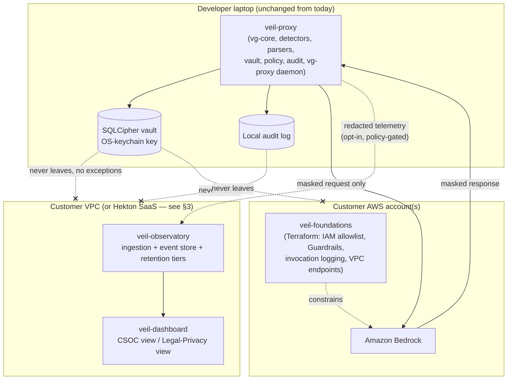
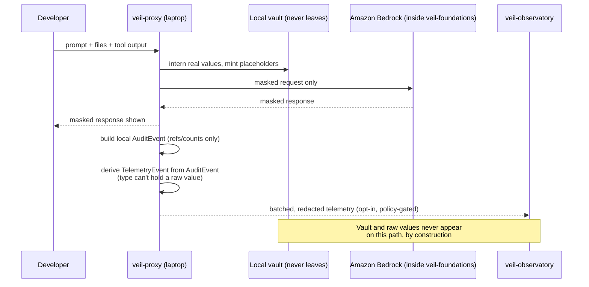
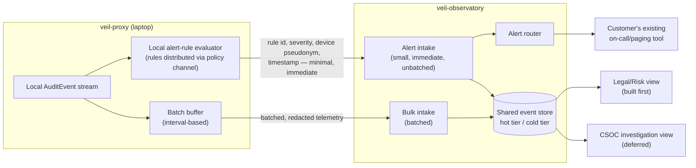

# VeilGremlin Product Family — Architecture

**Status:** DRAFT — design proposal, partially acted on (see the update note below), not fully
ratified. This document does not change any code, crate name, `Cargo.toml`, or `session-log.md`.
See `docs/decisions.md` for the corresponding PROPOSED decision entries and
`docs/next-actions.md` for the resulting queue item.

**Scope:** naming/taxonomy, component architecture, trust boundaries, personas and dashboard
sequencing, device identity, the Bedrock control-plane design (`veil-foundations`), an
AWS-native dashboard evaluation, the gaps this expansion opens up, sequencing, and open
questions for the human to decide. Where this document speculates beyond what the repo today
establishes, it says so.

> **Update (2026-07-26):** the project-identity layer of §1.2's recommendation has already been
> applied in the working session, and differs in one respect from what §1.2 originally argued
> for — see the note inline in §1.2. Q4 (dashboard build order) and Q7 (device identity) below
> have also moved from open to (fully, and partially) resolved — see §4, §6, and §10.
>
> **Naming supersession:** the component described throughout this document as
> **`veil-foundations`** was originally named `veil-walled-garden`. Same deliverable, renamed once
> inference profiles and per-team cost attribution came into scope, which "walled garden" does not
> suggest. If you encounter the older term in session logs, build-log entries, or earlier commits,
> it refers to this component. The repo now exists at `dermdunc/veil-foundations`.
>
> **Sibling repos now exist.** `veil-custodian` and `veil-foundations` were scaffolded and their
> implementation plans merged on 2026-07-26. `veil-observatory` remains deliberately uncreated —
> it is gated behind Phase 1a of `implementation-plan.md`.
>
> **Q7 is now fully resolved:** attestation is **mTLS device certificates** (human decision,
> 2026-07-26). See `veil-custodian`'s `docs/decisions.md` ADR-A. **Retention** is likewise settled:
> a 24-hour hot tier feeding S3, with lifecycle tiering for regulatory hot and cold archive
> (ADR-B), which closes the retention half of Q8.

---

## 0. Why this document exists

Everything built so far — T01 through T11, the masking-proxy milestones M1/M2 — is one thing:
a **local, laptop-only** control that keeps real PII and secrets out of a coding agent's cloud
context. It has no network dependency in its hot path, no central server, and (as of the T11
sign-off) an honest, still-open gap: the hook adapter alone doesn't deliver on "PII never leaves
the machine," which is why `vg-proxy` — the actual masking proxy — exists and is mid-build.

The ask this document answers: turn "VeilGremlin" from *the name of this one repo* into *the
name of a product family* — a masking data plane, a telemetry/audit plane, a dashboard serving
two different audiences, and a Bedrock invocation control plane — without quietly breaking the
one claim that makes this product worth building in the first place. That tension is addressed
head-on in §3, not glossed over.

---

## 1. Naming and Product Taxonomy

### 1.1 The family

| Name | What it is | Status |
|---|---|---|
| **VeilGremlin** | The umbrella product family name. Not a repo, not a binary — the name used in cross-component positioning, pitch material, and the shared trust story. | Proposed |
| **veil-proxy** | The masking data plane — parse → detect → vault → policy → masked pack, plus the in-flight masking proxy (`vg-proxy`) that intercepts the real request/response. **This repo.** | Proposed name for this repo's external identity |
| **veil-observatory** | The telemetry / audit / evidence plane. Ingests redacted, structured events from a fleet of `veil-proxy` instances; serves the dashboard. | New, not yet built |
| **veil-dashboard** | Two query surfaces over `veil-observatory`'s store — CSOC and Legal/Privacy. Proposed as part of the `veil-observatory` repo, not a fourth repo (see §1.3). | New, not yet built |
| **veil-foundations** | Terraform for Amazon Bedrock as an LLM invocation control plane — IAM allowlists, Guardrails, invocation logging, VPC endpoints, cross-account layout. | New, not yet built |

### 1.2 The concrete question: does `veil-proxy` stay one repo, and what happens to `vg-*`/`vg`?

**Recommendation: keep everything mechanical exactly as it is. Do not rename the crates or the
`vg` binary — now or, absent a strong new reason, ever.**

This isn't just because the brief for this document forbids renaming — the analysis
independently arrives at the same place:

- **The crate prefix and binary name are not the thing that's confusing.** The confusion is
  that "VeilGremlin" has been doing double duty as both a family name and a single component's
  name. Fixing that is a *documentation and positioning* problem, not a *source* problem. Once
  this doc and the README say plainly "VeilGremlin is the family; this repo is `veil-proxy`,
  its masking data plane," the crate names underneath stop mattering to anyone outside this
  repo — nobody outside this codebase types `vg-core` or cares what it's called.
- **`vg` as a short CLI verb is a feature, not a naming leftover.** `git`, `gh`, and `rg` don't
  spell out their product name either; a terse, muscle-memory binary name is standard practice
  for a tool developers invoke dozens of times a day (`vg run -- claude ...`). Renaming it to
  something longer to match "veil-proxy" would make the CLI *worse* to use, in exchange for
  a cosmetic consistency win nobody but the maintainers will ever notice.
- **The real cost of renaming the crates now is not small.** Two branches are open and unmerged
  today (`agent/claude/t10-fp-detector-fixes`, `agent/claude/vg-proxy-m2-daemon-core`). A crate/
  binary rename touches every `Cargo.toml` package name, every `vg_core::`/`vg_vault::`/etc.
  import path across 10 crates, the CLI help text, every doc in this repo (`README.md`, the full
  requirements spec, `interface-contracts.md`, and — critically — `docs/decisions.md`'s
  historical entries, which must **not** be rewritten to describe a past that didn't use the new
  name). Doing that mid-flight of two unmerged branches would produce merge conflicts with no
  functional payoff.
- **The GitHub repo rename remains cheap and still deferred.** GitHub auto-redirects renamed
  repos, so existing clones/CI don't break whenever it happens — but it isn't required now (§10
  Q1), and doing it speculatively, before a second family repo exists to disambiguate from, buys
  nothing.

**Update — the Hekton-registration layer already moved, differently from this section's original
stance, and that is now settled (2026-07-26).** This section originally argued the Hekton
project registration (`project_name: veilgremlin`) should stay untouched, separate from the
family/component naming split, on the theory that a Hekton project rename is a structural change
needing its own authorisation. In the actual working session, the human made that call directly
and differently: `.hekton/project.yaml`'s `project_name`, `project_title`, and
`mind_palace_path` were updated to `veil-proxy` (with an inline comment recording the family/
component relationship), while `github_remote_url` was deliberately left pointing at the
existing `veilgremlin.git` remote (with a comment recording the GitHub rename as the still-
deferred half of this, §10 Q1). **Net effect, and the thing worth keeping straight:** the Hekton
project registration and this repo's own framing docs (`README.md`, `CLAUDE.md`, `AGENTS.md`,
`CODEX.md`) already say `veil-proxy`. Only two layers remain unchanged, exactly as this section
still recommends: the GitHub remote URL, and the crate/binary/runtime-identity layer
(`.veilgremlin/` state directory, `com.veilgremlin.vault` keychain service, the `vg` binary and
`vg-*` crates).

### 1.3 One repo, two repos, or four?

**Recommendation: three repos total.**

| Repo | Contains | Why not split further / why not merge |
|---|---|---|
| `veilgremlin` (external identity: `veil-proxy`) | Everything that exists today: `vg-core`, `vg-detectors`, `vg-parsers`, `vg-vault`, `vg-policy`, `vg-audit`, `vg-cli`, `vg-adapters-claude`, `vg-bench`, `vg-proxy` | One deployable unit, one release cadence, one threat model (laptop-local, no network in the hot path). Splitting the masking core across repos would buy nothing — no other component reuses `vg-vault` or the detectors. |
| `veil-observatory` | Ingestion service, event store, retention/tiering, evidence-pack generation, **and the dashboard** (as an app within this repo, e.g. `apps/dashboard`) | The dashboard has no independent data model — both CSOC and Legal/Privacy views are two query surfaces over the *same* observatory event store. A fourth repo for the dashboard alone would add cross-repo API-versioning overhead for zero isolation benefit. Split it out later only if a distinct frontend team/release cadence actually forms (flagged as an open question, §10). |
| `veil-foundations` | Terraform modules + supporting docs only | Different artifact type entirely (infra-as-code vs. Rust binary), different review discipline (cloud/security sign-off, not `cargo test`), different deploy mechanism (`terraform apply`, not a release binary), and — importantly — genuinely independent of the other two: it can be built and applied without `veil-proxy` or `veil-observatory` existing at all. |

**A fourth, lightweight thing worth naming even though it isn't a repo of its own:** the
**telemetry event schema** that `veil-proxy` emits and `veil-observatory` ingests needs the same
discipline this repo already applies to `interface-contracts.md` — frozen, versioned, changed
only through a change protocol, because this repo's own history (§1 of `interface-contracts.md`,
the T02 doc-drift finding) is direct proof of what happens when a cross-boundary contract isn't
treated that way. Recommend a small, versioned schema document (JSON Schema or protobuf, not
Rust-only, since `veil-observatory`'s ingestion path may or may not be Rust — see §2) living in
whichever repo the ingestion side considers canonical, referenced by both. §7.4 revisits this
schema's format specifically once AWS-native storage options are on the table.

---

## 2. Component Architecture



### veil-proxy

| | |
|---|---|
| **Responsibilities** | Everything this repo does today: parse/detect/mask/vault/policy/audit, the masking proxy intercepting the real request/response (M3+), local demask. |
| **Explicit non-responsibilities** | Does not decide fleet-wide policy (only resolves the 3-layer policy it's given). Does not aggregate telemetry across machines. Does not authenticate its own actor (`--actor`/`--role` remain self-asserted attribution — see §6). Does not gate *whether* Bedrock will accept a call at all (that's `veil-foundations`) — it only minimizes *what's in* the call it's allowed to make. Does not run incident-response workflows. |
| **Interfaces to other components** | Emits the existing local `AuditEvent` types (unchanged). New, additive: an opt-in telemetry emitter (§3) sending a *narrower*, purpose-built event type toward `veil-observatory` on two lanes — batched bulk and immediate alert (§4.2). Sits inside whatever IAM/network boundary `veil-foundations` establishes for Bedrock calls — composes with it, doesn't call into it directly. |
| **Deployment model** | Laptop only. A cloud desktop/VDI session is architecturally identical to a laptop for this purpose (one developer, one local vault) and needs no special-casing. **Never** a shared multi-user service — that would break the one-vault-per-developer model this whole design rests on. |

### veil-observatory

| | |
|---|---|
| **Responsibilities** | Ingest redacted, structured telemetry from a fleet of `veil-proxy` instances on two lanes (batched bulk, immediate alert — §4.2); durable, retention-managed, tiered storage; serve the two dashboard query surfaces (§4); generate evidence packs for auditors/regulators; fleet inventory (which laptops are on which policy/detector version — directly needed for §8.4); route alert-class events to a customer's existing on-call tool. |
| **Explicit non-responsibilities** | **Never** receives raw PII, secrets, vault keys, or reversal material — structurally, not just by policy (see §3's type-level enforcement proposal). Does not perform detection/masking itself; it consumes already-masked telemetry, never re-scans raw content. Does not hold demask authority — it can show "a demask event happened, to destination X, decision Y" but never the underlying value, because it never had it. Does not resolve device pseudonyms to real identities itself (§6) — that's a separate custodian by design. |
| **Interfaces** | Two ingestion endpoints `veil-proxy` pushes to: batched bulk telemetry, and immediate individual alert events (§4.2; also open question §10 Q3, Q10). A read/query API the dashboard consumes. An export/evidence-pack generation API. An alert-routing hook into the customer's on-call tooling. |
| **Deployment model** | Customer VPC (self-hosted) for enterprise customers, or a Hekton-hosted multi-tenant SaaS for smaller orgs. **Recommend VPC-first, SaaS deferred** — see §3 and §10 Q5. An AWS-native implementation is a plausible deployment target, evaluated in §7. |

### veil-dashboard

| | |
|---|---|
| **Responsibilities** | **Built first:** the Legal/Privacy/Risk view — retention-bounded historical query, minimal-by-default fields, evidence-pack export. **Also day one, but not the same thing:** CSOC *alerting* — notification on defined bad-behaviour patterns, routed to the customer's existing on-call tool, not a full investigation UI. **Deferred:** the full CSOC near-real-time investigation surface (drill-down, correlation, case management). See §4 for why the split works this way and what "alerting" costs underneath. |
| **Explicit non-responsibilities** | No raw-value access (there is none to have). Not a SIEM replacement — should export to a customer's existing Splunk/Sentinel/etc. rather than reinvent alerting infrastructure, matching the spec's own already-anticipated "SIEM export formats" line. Not a device-identity resolver (§6) — it can show a device pseudonym, never a real identity, without a separate authorised step. |
| **Interfaces** | Read-only query API against `veil-observatory`; RBAC gating which fields/tier a given role can see (§4 covers why this matters — the two personas' needs genuinely conflict, not just differ). |
| **Deployment model** | Co-located with `veil-observatory` (VPC, SaaS, or AWS-native per §7 — matching whichever the customer chose). |

### veil-foundations

| | |
|---|---|
| **Responsibilities** | Terraform for: IAM model allowlists (which principals may invoke which Bedrock models), Bedrock Guardrails configuration, invocation logging (CloudTrail + Bedrock model-invocation logging to S3/CloudWatch), VPC endpoints/PrivateLink so Bedrock traffic never traverses the public internet, cross-account layout (a dedicated AI-invocation account, consumed via assumed roles from application accounts). |
| **Explicit non-responsibilities** | Does not inspect or mask content — that is `veil-proxy`'s job, entirely. Does not manage vault/reversal material — orthogonal data path. Does not require `veil-proxy` to exist; a customer could deploy either independently (see composition note below). |
| **Interfaces** | None to the other two components at the code level — the "interface" is that `veil-proxy`'s Bedrock calls happen to execute *inside* the account/network boundary this Terraform establishes. No shared library, no API. |
| **Deployment model** | Customer AWS account(s), applied via Terraform, reviewed by cloud/security engineering — a fundamentally different artifact and review discipline from the other two. |

**Composition as defense in depth:** `veil-proxy` minimizes *what* goes out; `veil-foundations`
constrains *whether it can go out at all, and to which model*. Deployed together, a leak
requires **both** a masking failure **and** an invocation-authority failure — genuinely
independent layers, not two names for the same control. Deployed alone, each is weaker in a
specific, nameable way: `veil-foundations` without `veil-proxy` constrains models but not
content (an authorized user can still send raw PII to an allowlisted model). `veil-proxy`
without `veil-foundations` minimizes content but not invocation authority (anyone with AWS
credentials can call any enabled model directly, bypassing the laptop entirely). **Recommend
both**, but the document doesn't pretend either is sufficient alone.

**A genuinely useful side effect of the combination, worth stating plainly:** if
`veil-foundations`'s Bedrock invocation logging is enabled, and all traffic reaching Bedrock
has already passed through `veil-proxy`, then AWS's own invocation log becomes a **second,
redundant, masked-only audit trail** — populated entirely by AWS, outside VeilGremlin's control,
and still never containing raw PII (because by the time content reaches Bedrock, `veil-proxy`
already masked it). That's a real, checkable claim, not marketing: it only holds if the
composition is enforced (IAM makes bypassing `veil-proxy` impossible), which is exactly what
`veil-foundations`'s allowlist is for.

---

## 3. Data Flow and Trust Boundaries — Resolving the Central Tension

### 3.1 State the tension plainly

Today's claim, stated multiple ways across this repo's own docs: *"the cloud model sees
placeholders, not the values behind them"* (true, and unaffected by anything in this document —
it's about what the *model* sees, not what a *central plane* sees). But the T11 sign-off entry
(`docs/decisions.md`, 2026-07-19) uses a stronger, related claim: *"invisible governance; PII
never leaves the machine."* **An observatory, a central dashboard, and a CSOC feed all imply
something leaves the machine.** That claim, as worded, becomes false the moment
`veil-observatory` exists and a laptop is configured to report into it. Pretending otherwise
would be exactly the kind of over-claim this project has structurally refused to make so far
(the published NO-GO numbers, the "not a GDPR compliance guarantee" positioning note). This
section resolves it the same way: state the weaker, true claim, precisely.

### 3.2 What never crosses the boundary — no exceptions

- The vault itself: the SQLCipher database file, its encryption key, the OS-keychain wrap, the
  HMAC salt.
- Any raw detected value (a real name, email, account number, secret) in any form — plaintext,
  hashed-but-reversible, or otherwise.
- The full, unmasked request or response body, in whole or in part.

This is **unconditional** — true with or without `veil-observatory` deployed, true regardless of
policy configuration, true regardless of role. It is the actual reversal material, and reversal
material staying on the laptop is the one claim worth keeping absolute.

### 3.3 What can cross the boundary — only if `veil-observatory` is deployed and enabled

The existing local audit log (`vg-audit`'s `AuditEvent` — `Scan`, `PolicyDecision`,
`MappingCreated`, `Block`, `DemaskRequest`, `DemaskDecision`) already contains **only** refs,
counts, entity types, and versions — never raw values, and this is already property-tested
(`assert_audit_event_excludes_raw_values`, which checks both the literal value and its
`Debug`-escaped form). **This is the load-bearing fact that makes an observatory honest at
all: shipping telemetry elsewhere is "forward the audit log this repo already keeps," not "add
a new raw-value capture mechanism."** The gap to close is smaller than it first sounds — but it
is not zero, for two reasons below.

A telemetry event may contain: entity-type counts, policy decisions and their policy version,
mapping *references* (opaque UUIDs, never resolvable without vault access that never leaves the
laptop), block reasons, demask request/decision records (actor id, destination, allow/deny,
policy version — **never** the resolved value), latency measurements, detector/policy version
identifiers, and a machine/session identifier.

A telemetry event must **never** contain: anything in §3.2, and — this is the first of the two
real gaps — **the machine/session/actor identifiers themselves are enterprise-sensitivity-class
data under this project's own taxonomy** (hostnames, usernames, employee IDs are explicitly
"enterprise sensitivity" entities in `docs/spec/requirements-and-design-spec.md`'s taxonomy).
An observatory event carrying a raw hostname or username is itself a minor version of the exact
problem this whole product exists to prevent. **Recommendation: the telemetry emitter must run
its own payload through the same mask-before-transmit discipline** — actor/machine identifiers
sent to `veil-observatory` should themselves be a stable pseudonym, never a raw string, even
though this is "just" metadata about who used the tool rather than what they pasted into it. §6
develops exactly this mechanism in depth, since the direction for it is now set.

### 3.4 The second real gap: convention isn't enough, use the type system

`interface-contracts.md` §1 already documents that `MaskedPack`'s "no raw value" invariant is
**tested, not type-enforced** — every field is `pub` with no smart constructor, so nothing stops
code from hand-constructing a `MaskedPack` with a raw value in it; only test discipline catches
that. That's an accepted, documented weakness for a library API a small number of trusted crates
call. **It is not an acceptable weakness for a network-facing telemetry emitter**, which is new,
greenfield code with no legacy constraint forcing the same shape.

**Recommendation:** define a new, narrow `TelemetryEvent` type — not a re-export or wrapper of
`AuditEvent` — constructible **only** via an exhaustive, reviewed `From<&AuditEvent>` (or
equivalent) conversion. The emitter function's signature should be unable to accept a raw
buffer, a `Secret`, or an `Input` at all — the type system, not a convention, should make "the
emitter sent something it was never given a way to hold" the enforced invariant. This is
strictly stronger than what `MaskedPack` does today, and it's cheap to do now because nothing
depends on the old, weaker shape yet. **This guarantee holds at the emitter boundary only** —
§7.5 addresses what fills the gap once the event lands in a central store.

### 3.5 The honest restated claim

Proposed replacement wording (for `README.md` and any family-level positioning, **not** applied
here — this is the proposal, ratification is a separate step per §0):

> **Reversal material — the vault, its encryption key, and the raw values it protects — never
> leaves the laptop. Full stop, with or without an Observatory deployed.** What *can* leave the
> laptop, only when an organisation opts into fleet observability, is masked telemetry: counts,
> references, policy decisions, and outcomes — never a value a human could read as someone's
> name, account number, or secret. If your organisation runs `veil-proxy` standalone, nothing
> leaves the laptop at all beyond the masked model call itself.

This is weaker than "PII never leaves the machine" and it is true. That trade is the whole
point — a strong false claim is worse than a weaker true one, and this project has already
demonstrated (the published 16.7% FP-rate NO-GO) that it's willing to make that trade.

### 3.6 Sequence: what an observatory-enabled session actually sends



---

## 4. Personas and Their Jobs

**Resolved (2026-07-26): the Legal/Risk/Privacy view is built first; CSOC gets alerting — not
the full investigation surface — from day one.** This section explains what that split actually
requires underneath, because "alerting from day one" is not free given a Legal/Risk-first build
order: it needs a capability and a delivery path a Legal/Risk-only system would never need on
its own.

### 4.1 The persona table

| Persona | Wants | Where it conflicts with another persona |
|---|---|---|
| **Developer** | Unaffected by any of this — still just wants low friction, transparency, no surprise network calls. Should be able to see, locally, *whether* their machine is reporting telemetry and to where. | — |
| **CSOC analyst** | **Day one:** alerting on defined bad-behaviour patterns (a spike in `Block` events, an unusual demask destination, a machine reporting a stale policy/detector version) delivered fast enough to act on, routed into existing on-call tooling. **Later, deferred:** the full near-real-time investigation surface — drill-down, correlation, SIEM export. | Still wants investigation-depth detail eventually; Legal/Risk wants minimisation and short retention. Resolved without relaxing the latter — see §4.3. |
| **Privacy / DPO** | Minimisation by default, short retention windows, an on-demand evidence pack for a regulator, an answer to "was this individual's data processed by an AI system, and how." This is the view built **first**. | Wants fields reduced/expired quickly; CSOC wants enough signal and history to detect patterns over time. |
| **Risk** | Aggregate trend of the same Go/No-Go metrics this project already publishes (FP rate, recall, latency) rolled forward into ongoing production monitoring, not just a one-time `vg bench` report; policy-compliance percentage across the fleet; exception counts. | Wants aggregate visibility that individually low-priority privacy concerns feed. |
| **Platform / enterprise admin** | Fleet enrollment (MDM), policy distribution/versioning, detector-pack rollout status, cost/usage metering, and — new — alert-rule authoring/distribution once the fixed initial rule set (§9) needs customisation. | Needs enough machine-level detail to manage a fleet; same tension as CSOC vs. privacy, one layer down. |

### 4.2 What "alerting from day one" actually requires, beyond a Legal/Risk data model

The user's own read is worth confirming directly: **yes, the two dashboard views are
substantially the same underneath.** Both are RBAC-scoped lenses over one shared, tiered event
store (§3.3, §4.4). Legal/Risk needs retention-bounded historical query, minimal fields by
default, and evidence export. A *full* CSOC investigation surface would need the same underlying
events, just a different filter and richer fields. If that were all "alerting" meant, building
Legal/Risk first would already cover it by construction.

But alerting is not a query over history — it's a notification that fires while something is
still happening, and that is genuinely new in three ways a Legal/Risk-first data model alone
doesn't give you:

1. **A rule evaluator that runs close to real time.** Rules like "N `Block` events in an unusual
   pattern," "a demask to a destination not seen from this device before," or "a device
   reporting a detector/policy version older than the fleet's current one" (§8.4) need to be
   evaluated against events as they occur, not batched and queried later. **Recommend evaluating
   these locally, in `veil-proxy`**, against a small, versioned rule set distributed the same
   way policy is (§8.3) — not centrally in `veil-observatory` against a backlog of batched
   telemetry, since central evaluation is only as fast as the batch interval feeding it (next
   point).
2. **The latency floor the batched-push topology (§10 Q3) imposes — resolved explicitly, not
   quietly reopened.** §10 Q3 recommends batched push for bulk telemetry, which is correct: no
   timeliness requirement there at all. But an alert riding the same batch interval inherits
   that interval's delay, which defeats the point of an alert. **Resolution: alert-class events
   get a second, distinct delivery lane — sent individually and immediately on a rule match,
   never batched — alongside the unchanged batched bulk-telemetry lane.** This isn't a reason to
   revisit the batched-push recommendation for bulk telemetry; it's a reason not to force one
   lane to serve two jobs with incompatible latency requirements.
3. **Somewhere for the alert to go.** A fired rule needs to reach a human, meaning integration
   with whatever on-call/paging tool the customer already runs (PagerDuty, Opsgenie, a webhook
   into their SIEM) — the same "don't reinvent what the customer already has" principle §2
   already applies to SIEM export.



### 4.3 Resolving the conflict without quietly relaxing the stricter requirement

The mechanism that keeps this honest: **the alert-lane payload is *more* minimised than bulk
telemetry, not less.** It exists to notify fast, not to prove or investigate — a rule id, a
severity, a device pseudonym (§6), and a timestamp is enough to page someone; it is deliberately
not enough to reconstruct what happened. Whatever CSOC needs to actually investigate a paged
alert lives in the same hot tier that Legal/Risk's retention discipline already governs (§4.4)
— it does not get a silent exemption from that tier's TTL or pseudonymisation defaults just
because CSOC asked for it. **Concretely: what CSOC gets on day one is speed, not scope.** Nothing
in the shared store is retained longer or held less pseudonymised merely because an alert fired
against it. If a real investigation later needs more than the hot tier's default fields hold,
that has to go through the same explicit, audited re-identification step §6 describes for
device→user resolution — not a standing exception baked into the schema.

### 4.4 Retention tiering, updated for the alert lane

- **Hot tier**: short TTL, feeds both the alert router and (later) the CSOC investigation view.
  Its fields are pseudonymised by default (§6) even though it's the "richer" tier — richer means
  more event types and finer time resolution, not raw identifiers.
- **Cold tier**: longer retention, further reduced/aggregated, feeds the Legal/Risk view and
  evidence-pack generation.

Unchanged in spirit from the original design; new here is stating explicitly that the alert lane
writes into the hot tier under the same rules — it does not bypass them.

**A conflict worth naming that isn't in the persona table above:** CSOC incident response
sometimes genuinely needs to know *whether a real leak occurred*, which the telemetry stream
structurally cannot answer (it never has the value). That's not a dashboard feature gap — it's
a workflow gap, covered in §8.6.

---

## 5. veil-foundations in Depth

### 5.1 What Bedrock actually enforces, stated honestly

| Bedrock feature | What it enforces | What it does *not* enforce |
|---|---|---|
| IAM policies / resource-based policies | *Who* (which principal/role) may call *which* model, in *which* region | Nothing about the content of a permitted call |
| Bedrock Guardrails | Content-category filtering (denied topics, its own PII detection/redaction, word filters) on requests/responses that reach Bedrock | Reversible pseudonymisation, referential stability across a session, or anything about content *before* it reaches AWS — by the time Guardrails act, the content has already left the enterprise network boundary in trust terms, even if the call itself never left a VPC in network terms |
| Model invocation logging | An audit trail of invocations (and optionally the actual payloads) into the customer's own S3/CloudWatch | Nothing about whether that logged payload contains PII — if `veil-proxy` didn't mask it first, invocation logging faithfully stores the raw leak too |
| VPC endpoints / PrivateLink | Bedrock traffic never traverses the public internet | Nothing about model selection or content — purely a network-path guarantee |
| Cross-account layout | Blast-radius containment (a compromised application account can't directly touch the AI-invocation account's IAM surface) | Nothing about content or model choice by itself — it's an IAM/account-boundary control |

**The overlap between Bedrock Guardrails' own PII redaction and `veil-proxy`'s masking is worth
flagging as an unresolved integration question, not assumed away:** Guardrails may not recognise
already-masked placeholder text (`EMAIL_001`) as something it needs to act on (good — nothing to
redact), but it's untested whether Guardrails' own heuristics could **misfire on placeholder
text itself** (flagging `ACCOUNT_ID_014`-shaped strings as suspicious, or conversely treating
masked content as a signal to relax scrutiny it shouldn't). This needs an integration test once
`veil-foundations` and `veil-proxy` are both real, not assumed to compose cleanly.

### 5.2 Terraform module sketch (speculative — no AWS account exists to validate against yet)

```
veil-foundations/
  modules/
    iam-model-allowlist/       # per-role/per-principal Bedrock model invoke permissions
    bedrock-guardrails/        # guardrail definitions: denied topics, PII filters, word lists
    invocation-logging/        # CloudTrail + Bedrock model-invocation logging -> S3/CloudWatch
    vpc-endpoints/             # PrivateLink endpoints for bedrock-runtime / bedrock-agent
    cross-account-roles/       # AI-invocation account <-> application account assume-role trust
  environments/
    dev/
    staging/
    prod/
  docs/
    decisions.md               # same ADR discipline as this repo
    threat-model.md
```

Each `environments/*` composes the modules per account; the cross-account module is what makes
"a dedicated AI-invocation account, not folded into an application account" real rather than
aspirational.

**Recommendation on scope:** build the Bedrock module first — it matches the existing reference
architecture and (per the spec) the current customer path. But don't hardcode "bedrock" into
every module/variable name if a two-line rename avoids future lock-in; `veil-proxy`'s own
`Destination` enum is already `#[non_exhaustive]` and provider-agnostic in spirit (Azure/Vertex
could be added later without a `veil-core` rewrite per the existing "LiteLLM Future Integration
Path" section of the spec). A small naming discipline now (`invocation-logging` not
`bedrock-invocation-logging`, `iam-model-allowlist` not `iam-bedrock-allowlist`) keeps the door
open cheaply. This is a minor hedge, not a redesign — flagged as §10 Q6 since it's a real
cost/flexibility tradeoff, however small.

---

## 6. Device Identity and the Device→User Mapping

The user's own direction (2026-07-26): key the observatory on the *device*, not the user, and
hold the device→user mapping separately — motivated by data minimisation, and noting that today
a device name is already sent in logs with a mapping route (MDM/CMDB) already existing in
practice. This section develops that direction properly and says where it's genuinely strong,
where the premise needs correcting, and what remains open.

### 6.1 Start with what's wrong with the status quo, so the target is clear

If a device name is logged anywhere today, that name is very likely something like
`dermdunc-macbook` or a corporate asset tag with a username baked in — which is not a neutral
identifier, it's a **direct identifier under this project's own taxonomy**
(`docs/spec/requirements-and-design-spec.md`'s "enterprise sensitivity" class already names
hostnames and employee IDs explicitly). §3.3 already flagged this: an observatory event carrying
a raw hostname is a smaller version of the exact leak this product exists to prevent.

**"Key on device" only helps if the key is an opaque device pseudonym minted at enrolment —
never the OS hostname, never anything a human recognises.** The premise in the original request
("device name is already sent in logs today, and a mapping to a user already exists via
MDM/CMDB") describes precisely the thing to fix, not a baseline worth preserving. If
`veil-observatory` ends up storing the same recognisable hostname the fleet was trying to move
away from, nothing has improved — the leak has just moved from "local audit log" to "central
telemetry store," which is a regression relative to §3.2's promise, not progress.

### 6.2 The real design: an opaque device reference, a separately-held mapping, explicit resolution

This is architecturally the same pattern `veil-proxy` already ships for data — an opaque
reference (`MappingRef`), a mapping held under access control, and resolution that is explicit,
authorised, and audited (`rehydrate`, gated by `PolicyEngine::demask_allowed`, hard-denied for
remote/observability destinations). Applying that shape to *identity* rather than *content*:

- At enrolment, mint an **opaque device pseudonym** (e.g. a UUID or a keyed value, never derived
  from the hostname) — this is what `veil-observatory` ever sees, in every telemetry event and
  every alert.
- The device pseudonym ↔ real device/user mapping is held by a **separate custodian** — not
  `veil-observatory` itself, and not casually joinable by whoever operates the dashboard. This
  could be the existing MDM/CMDB (if access to it is itself controlled and audited) or a small,
  dedicated mapping service built for this purpose (§10 Q9).
- Resolving the pseudonym back to a device/user is an **explicit, authorised, audited act** —
  structurally the same shape as `vg demask`, not an ambient join anyone with dashboard access
  can run silently.

**Should this literally reuse `veil-proxy`'s `MappingRef`/vault/`rehydrate` machinery, or only
borrow the discipline?** Only the discipline — not the code, and not even the same trust
boundary. The vault's defining property is that it is **laptop-local and single-tenant**: one
vault, one machine, one developer, keyed by that machine's own OS keychain. The device→user
mapping is the opposite shape: it has to be **centrally queryable** (an IR investigation or a
regulator request needs to resolve *some* device, not just the one machine an investigator
happens to be standing in front of), held by a party distinct from the one running day-to-day
dashboard queries. Literally reusing the vault's API would either force the mapping to be
laptop-local (useless — nobody investigating an alert is sitting at that laptop) or force the
"laptop-local" vault to become a central multi-tenant service, which quietly breaks the property
that makes the *real* vault trustworthy in the first place. **Recommendation: a new, small,
purpose-built mapping-custodian component**, borrowing exactly three things from the vault/
rehydrate pattern — opaque reference, access-controlled store, explicit-and-audited resolution —
and nothing else.

### 6.3 What actually makes this a real control, not decoration

Pseudonymisation is cosmetic if the party holding the telemetry can trivially re-identify anyone
in it — e.g. if the team running `veil-observatory` also has standing read access to the CMDB
that maps pseudonyms to names, nothing has been protected; it's the same information one hop
away. What makes this a genuine control, not a decorative extra join:

- **Separation of duties**: the party that can *query telemetry* should not be the same party
  that can *resolve a device pseudonym to a real identity*, as a matter of role/access design,
  not just convention.
- **Every resolution is a logged, justified event** — who resolved which pseudonym, when, and
  under what authority (an open incident case ID, a DSAR reference, a specific audit finding) —
  mirroring `DemaskDecision`'s shape (actor, destination, decision, policy version) applied to
  identity resolution instead of data resolution.
- **Re-identification is a deliberate act, never an ambient capability.** Nobody should be able
  to look at a dashboard row and casually see the real device/user without that being a
  distinct, recorded step.

**Where this genuinely helps, and where it doesn't, stated carefully:** this is
**pseudonymisation, not anonymisation** — the same caveat the spec already states for content
("pseudonymised data remains personal data"). A device pseudonym plus a resolvable mapping is
still, in aggregate, personal data under GDPR; the control reduces exposure and adds friction/
audit around re-identification, it does not remove the data from scope. Don't oversell this as
"the observatory never has personal data" — the honest version is "the observatory's ordinary
operation never needs it, and touching the mapping is a distinct, audited event when it does."

### 6.4 Practical mechanics

- **Enrolment.** The device pseudonym is minted once, at MDM enrolment time (ties to §8.5), by
  whichever component owns enrolment — not by `veil-proxy` itself the first time it happens to
  run, since that would let an unmanaged device mint its own identity claim.
- **Rotation / re-imaging.** A re-imaged or reissued device should get a **new** pseudonym, with
  the mapping custodian recording the old→new linkage if continuity of history matters for that
  device — a policy choice, not an engineering default.
- **Shared or multi-user devices.** The device pseudonym identifies the *device*, not the
  session's actual actor — a shared device needs a session-scoped actor claim layered on top,
  tying directly back to §10 Q7's unresolved authentication mechanism: a device pseudonym
  answers "which machine," not "which person was sitting at it," and this design must not
  conflate those two questions.
- **Contractor / BYOD.** A device not enrolled via the org's MDM has no legitimate way to mint a
  trustworthy pseudonym at all — this is a real gap, not a detail: BYOD/contractor access likely
  needs either a stricter, session-scoped identity issued per-engagement, or an explicit policy
  decision to exclude unmanaged devices from fleet telemetry entirely.
- **Lost device / employee offboarding.** The mapping custodian, not `veil-observatory`, is the
  natural place to revoke/expire a mapping on an HR-triggered offboarding event — ties directly
  to §8.2's vault-revocation gap; the device pseudonym can be retired without `veil-observatory`
  needing to know anything changed.

### 6.5 What remains open

This section sets the **direction** — device-keyed, opaque pseudonym, separately-held mapping,
explicit resolution — but not the **mechanism** that stops a device from lying about which
device it is in the first place. That is §10 Q7, unchanged in substance: mTLS device
certificate, TPM/hardware attestation, or an SSO/IdP token exchange are all plausible, each with
different usability/offline/revocation-speed tradeoffs, and choosing between them is a dedicated
security-architecture decision this document still does not make. Everything above assumes it
gets answered; it does not answer it.

---

## 7. AWS-Native Dashboard Options

Since `veil-foundations` already puts the customer in AWS, it's worth evaluating whether the
dashboard/observatory's visualisation and query layer should be built from AWS-native managed
services rather than a bespoke stack.

### 7.1 The candidate stack

| Service | Role here | Fit |
|---|---|---|
| Amazon QuickSight | Visualisation/BI layer for both Legal/Risk and CSOC views | Genuinely plausible — a real BI tool with row-level security (RLS) already, which is most of what a role-scoped dashboard needs |
| Amazon Athena (over S3) | Query engine over the telemetry event store, if stored as columnar files in S3 | Fine for the Legal/Risk view's retention-bounded historical queries; wrong tool for the alert lane (see below) |
| AWS Lake Formation | Row-level and column-level access control, cell-level masking, over the same S3/Athena data | The genuinely interesting fit — see §7.2 |
| Amazon OpenSearch | Near-real-time search/alerting | Needed *only* if the alert lane (§4.2) is built on it — Athena's latency profile doesn't suit alerting |
| AWS Security Lake / OCSF | Normalise events into a schema CSOC teams may already ingest from other tools | Worth adopting as the wire format if the customer already runs a Security-Lake-fed SIEM — reduces integration work on their side |

### 7.2 Testing the claim: does Lake Formation actually map onto the split we need?

The interesting hypothesis is that Lake Formation's row-level filters + column-level masking map
directly onto "Legal/Risk sees aggregates, CSOC sees alert detail, re-identification is a
separate authorised step" (§4, §6). Worked through, this holds up reasonably well, with one real
gap:

- **Column-level masking** can hide the device-pseudonym-to-anything-resolvable column from a
  Legal/Risk-scoped IAM role while showing it (still pseudonymised, per §6) to a CSOC-scoped
  role — this maps cleanly onto the hot/cold tier split in §4.4, expressed as IAM/Lake Formation
  grants instead of application-level RBAC.
- **Row-level filters** can bound a Legal/Risk query to the cold-tier's retention window and a
  CSOC query to the hot tier's shorter, richer window — again, a clean fit.
- **The gap:** Lake Formation's access control governs *who can query which rows/columns of the
  stored data* — it does not, by itself, implement the *device pseudonym → real identity*
  resolution step §6 describes as a distinct, audited, justified act. That is a different kind
  of control (an application-level workflow with its own audit record, a specific case ID, a
  specific authoriser) than "this IAM role can see this column." **Recommendation: use Lake
  Formation for the tiering/masking split (a good fit for that), but implement the mapping-
  custodian resolution step (§6.2) as its own service with its own audit trail, not as a Lake
  Formation grant** — conflating "can query this column" with "can justify re-identifying a
  specific person" would understate how deliberate that act needs to be.

### 7.3 The honest downsides

- **QuickSight's per-reader cost model** gets expensive at fleet/dashboard-user scale in a way a
  self-hosted Grafana/Metabase-style stack doesn't — worth modelling against expected dashboard
  user counts before committing, not assumed cheap because "AWS already bills the customer."
- **Athena's latency is unsuitable for the alert lane** (§4.2) — seconds-to-minutes query
  latency over S3 is fine for Legal/Risk's after-the-fact queries, wrong for "page someone now."
  If this stack is chosen, the alert lane needs OpenSearch (or an equivalent) as a genuinely
  separate service, not "the same Athena tables, queried more often."
- **Lake Formation is operationally heavy.** Permission model complexity (LF-Tags, resource
  links, cross-account grants if `veil-observatory` and `veil-foundations` sit in different
  accounts) is a real ongoing maintenance cost, not a one-time setup.
- **The biggest one, stated plainly: committing `veil-observatory` to AWS-native services
  contradicts the VPC-portable posture recommended at §10 Q5.** A customer whose Bedrock usage
  sits in an AWS account (reasonable — that's what `veil-foundations` assumes) is not
  necessarily a customer who wants their *entire telemetry/dashboard stack* locked into
  AWS-specific managed services, especially if they operate multi-cloud or want to self-host
  `veil-observatory` without depending on AWS at all. **If this path is taken, say so as a
  knowing consequence**: `veil-observatory` becomes an AWS-only product, not a cloud-portable
  one, and that costs addressability with any customer not already committed to AWS for this
  workload.

### 7.4 Recommendation: commit to a portable data model, not a portable implementation

Don't try to make `veil-observatory` literally run identically on every cloud — that's a larger,
probably-not-worth-it engineering commitment. Instead: **define the telemetry event schema
(§3.4's `TelemetryEvent`) in an open, storage-agnostic format** (Parquet/Iceberg tables,
optionally OCSF-normalised events if targeting Security-Lake-fed SIEMs) so that AWS-native
(QuickSight + Athena + Lake Formation + OpenSearch) can be *one* deployment target for
AWS-committed customers, while a self-hosted Postgres/OpenSearch + Grafana-or-Metabase stack can
be *another* for customers who aren't. The commitment is to a data format and a query contract,
not to a vendor — the same "define the seam, let implementations vary" discipline this repo
already applies via `interface-contracts.md`'s traits.

### 7.5 Reconciling with §3.4's type-level guarantee

§3.4 proposed a `TelemetryEvent` type that's structurally incapable of holding a raw value —
that guarantee holds at the **emitter boundary**, in `veil-proxy`, in Rust's type system. The
moment the event lands in S3/Athena/a Lake Formation table, it's just data — rows and columns,
no compiler enforcing anything. **What fills that gap at rest and in query results is schema and
access control, not the type system**: the stored schema should only ever *define* columns that
correspond to `TelemetryEvent`'s fields (no ad-hoc "extra JSON blob" column that could
accidentally carry more than the type allowed before serialisation), and Lake Formation's
column/row grants (§7.2) are what stands in for "type enforcement" once the data is at rest. Two
different mechanisms, same invariant, deliberately continuous across the boundary rather than
assumed to carry over automatically.

---

## 8. Gaps the User Has Not Raised

This is deliberately one of the longest sections. The brief asked for this to be first-class,
not an afterthought — several of these are, honestly, harder than anything named in the naming/
component sections above.

### 8.1 Real authN/authZ — now developed as its own section

See §6 for the full treatment (device identity, the device→user mapping, and what it does and
doesn't solve) and §10 Q7 for the still-open attestation mechanism. Kept here as the gaps list's
one-line summary: `--actor`/`--role` are self-asserted today, not authenticated
(`README.md`, `docs/next-actions.md`'s F4 item), and a central plane cannot inherit that — §6
works through the direction now set; §10 Q7 leaves the cryptographic mechanism open.

### 8.2 Key and vault management at fleet scale

Today: one SQLCipher vault per laptop, key wrapped by that machine's OS keychain, no backup
story (arguably a deliberate feature — ephemeral reversal material). At fleet scale, unresolved:
key rotation policy; what happens to a lost/wiped/decommissioned laptop's vault (are its
mappings gone forever — is that acceptable, and does IT know not to "helpfully" back up
`.veilgremlin/` to a shared drive, which would be actively worse than the current state);
employee offboarding as an explicit trigger for vault revocation, not just an assumption it
happens naturally when the laptop is wiped.

### 8.3 Policy authoring, distribution, and versioning across a fleet

Today: 3-layer YAML/TOML (global → repo → session), loaded locally, signed-pack verification
already stubbed for later. At fleet scale, unresolved: who authors the global layer and how is
it reviewed; how is a policy update actually pushed to (or pulled by) thousands of laptops; how
does anyone know a laptop is on a stale policy (this is exactly what `veil-observatory`'s fleet
inventory needs to surface, tying this gap to §8.4); rollback if a pushed policy update breaks
something in production. **New with §4.2:** this same channel is the natural home for
distributing and versioning alert rules once the MVP's fixed initial rule set needs
customisation (§9).

### 8.4 Detector-pack updates and fleet-wide fix rollout

This project just closed a real false-positive NO-GO (16.7% → 0.0%, pending merge). **That fix
only matters once it reaches every laptop.** There is currently no release/update channel for
`vg`/detector packs beyond "someone rebuilds from source" — the spec's own supply-chain section
already anticipates signed releases and optional TUF-style auto-update metadata, but none of it
is built. Fleet-wide, this needs to compose with §8.3: `veil-observatory` reporting "N% of fleet
still on the pre-fix detector version" is the only way anyone would know a rollout is
incomplete.

### 8.5 Enterprise deployment and enrollment (MDM)

How does `veil-proxy` get installed, configured, and pointed at an org's `veil-observatory`
endpoint and root CA in the first place? Needs an MDM package (Jamf/Intune) and a config profile
injecting the policy-server URL, observatory endpoint, and trust material — tied to device
compliance state, which also feeds back into §6's identity story and is where the device
pseudonym (§6.4) actually gets minted.

### 8.6 Incident response workflow

When CSOC sees an anomaly and genuinely needs to confirm whether a real leak occurred, the
telemetry stream cannot answer that — it never has the value (§3, §4). That has to become a
defined, exceptional, heavily-audited **local** action, not a telemetry-channel capability.
Recommend a "remote-triggered local action" primitive: `veil-observatory` can flag a specific
laptop for a required action (rotate vault key, run `vg audit export` for a case ID, temporarily
force a stricter policy) — but it can never itself reach into that laptop's vault. This needs an
actual runbook, not just a primitive; not designed here.

### 8.7 DSAR / right-to-erasure vs. a vault of reversible mappings

The spec already states the hard truth: "pseudonymised data remains personal data." If a data
subject exercises a right to erasure, and their name sits reversibly pseudonymised in some
developer's local vault somewhere in a fleet, that is a **genuinely unsolved problem**, not a
missing feature. A fleet-wide "find and purge the mapping for value X" capability would require
either sending the raw value to every laptop for local matching (a new leak vector, defeating
the point) or a searchable-but-not-reversible index (a research-level privacy-engineering
problem — crypto-shredding / forgettable encryption). **Recommend treating this as an explicit,
documented non-goal for now**, compensated by aggressive default TTLs and an explicit local
purge command, rather than quietly implying it's solved. This is the single most honest thing
this document can say in this section — don't paper over it.

### 8.8 Retention and evidence-pack generation for auditors

Needs defined retention schedules per event class and tier (§4.4's hot/cold split), a defined
evidence-pack export format (extending the spec's already-gestured-at "DPIA-support pack"
concept into an on-demand generator), and its own integrity story — a signed export so a pack
can't be silently edited after the fact once handed to a regulator.

### 8.9 Usage and cost metering

Once there's a central plane, cost attribution (Bedrock spend per team/repo/project, proxy
overhead) becomes a legitimate FinOps ask, and — if this becomes a licensed product —
per-seat/per-invocation usage metering. Entirely unaddressed today.

### 8.10 Surfaces beyond coding agents

The spec's own "Primary Use Cases" section already names extensions this document should call
out explicitly as gaps, not just future work: plain chat interfaces, MCP servers (which are
*both* a context source needing masking *and* a destination structurally similar to model
egress), CI/CD pipelines (headless — no interactive human for actor attribution or demask
approval, needing a service-identity model entirely unlike a developer laptop), and IDE plugins
(Copilot/Cursor/Cline-style — the exact "Agentic Coding Context Map" the spec already draws but
never builds beyond Claude Code). Each needs its own adapter, and each has a **different**
actor-identity story — a CI job is not a person, which sharpens §6 rather than sidestepping it.

### 8.11 Offline / air-gapped operation

`veil-proxy` today needs no network to mask — that's foundational. Once `veil-observatory`
exists, an offline/air-gapped laptop must **not** be forced to choose between "can't mask" and
"must phone home." Recommend: telemetry (both lanes) queues locally (bounded buffer, user-visible
backlog) and drains on reconnect; masking itself must keep working with zero network,
unconditionally. Separately: `veil-foundations`'s entire premise is a *cloud* Bedrock account —
a genuinely air-gapped deployment needs a local-model destination instead, which the spec already
names ("unless the model is local and explicitly approved") but has never been built.

### 8.12 Additional gaps found in this pass

- **Multi-tenancy in `veil-observatory`/`veil-dashboard`** if Hekton hosts it as SaaS for
  multiple customers — strict tenant isolation, since the aggregated metadata itself (usage
  patterns, which repos are touched, headcount-adjacent signal) is sensitive even when every
  individual field is "just" a count.
- **The supply-chain threat model doesn't automatically extend to the two new repos.** Signed
  releases, SBOMs, `cargo-deny`/dependency review — all currently a `veil-proxy`-only discipline.
  `veil-observatory` and `veil-dashboard` are new attack surfaces and need the same treatment
  applied explicitly, not assumed inherited.
- **Break-glass / emergency access.** Nothing in the current design has an "operationally
  urgent, policy would normally block this" escape hatch. Enterprises often need one; it doesn't
  exist today, and it needs to be heavily audited if added.
- **Data residency / cross-border transfer of telemetry itself.** Even masked telemetry carrying
  device pseudonyms may count as personal data under some readings, especially combined with
  metadata — a centralized (esp. SaaS) `veil-observatory` raises its own residency question
  independent of the vault question.
- **Bedrock model lifecycle drift.** AWS deprecates/updates model IDs over time;
  `veil-foundations`'s allowlist needs an ongoing maintenance process, not just an initial
  `terraform apply`.

---

## 9. Sequencing

Dependency order, with an honest read on size. Items marked **(large)** are multi-quarter
efforts by the standard this project has already set for itself (T01–T11 plus M1/M2 took roughly
a month of calendar time); nothing below of that size should be estimated at milestone scale.

1. **Finish what's already in flight in this repo.** Merge the FP-rate fix
   (`agent/claude/t10-fp-detector-fixes`), the display-collision fix, and land M3 (request
   masking to Bedrock/Anthropic, non-streaming). This remains the actual priority regardless of
   anything in this document — an observatory ingesting telemetry from a proxy that doesn't yet
   mask the full request is observing an incomplete product.
2. **Real actor/device identity (§6). (large)** Foundational — blocks fleet policy distribution,
   dashboard RBAC, MDM enrollment (and the device-pseudonym minting it performs, §6.4), and
   evidence-pack chain-of-custody all at once. Needs its own design spike (§10 Q7) before any
   code.
3. **`veil-observatory` MVP: schema + *both* lanes, from the start.** Prove the `TelemetryEvent`
   type-level boundary (§3.4), then build the batched bulk-telemetry lane *and* the alert lane
   (local rule evaluation in `veil-proxy`, an immediate unbatched send path, a router into a
   customer's existing on-call tool) together — not the bulk lane first with alerting bolted on
   later, which would just replay the latency-floor problem §4.2 already resolved. Ship with a
   small, **fixed** initial rule set (the patterns already named in §4.1) rather than full
   fleet-configurable rules — that's step 5.
4. **Legal/Risk dashboard view + CSOC alert routing — the first user-facing milestone.** Ships
   together, since both draw on the single MVP built in step 3. The full CSOC investigation
   surface is explicitly not part of this step (see step 6).
5. **Policy + alert-rule + detector-pack distribution channel (§8.3/§8.4). (large)** Once the
   fixed initial rule set from step 3 is proven useful, build the general customisation/update
   channel — the same mechanism serves policy updates, alert-rule updates, and detector-pack
   rollout, and needs to exist before claiming "the fleet is on the fixed detector" means
   anything.
6. **Full CSOC investigation surface — deferred.** Drill-down, correlation, case management,
   built once the alerting lane (step 3-4) has generated real signal and demand for it, not
   speculatively alongside step 4.
7. **`veil-foundations` Terraform. (large)** Independent of 1–6; can start in parallel any time
   an AWS account exists to build against. Cross-account IAM, Guardrails config, and VPC
   endpoints each warrant their own security review.
8. **AWS-native dashboard evaluation (§7), if pursued.** Depends on step 3's event schema being
   finalised in a portable format (§7.4) before Lake Formation/Athena/QuickSight specifics are
   locked in — sequence after step 3, and realistically alongside or after step 7 if a genuinely
   AWS-native deployment is the target, since it benefits from `veil-foundations`'s AWS account
   already existing.
9. **Later-phase, largely additive once 1–8 exist:** MDM enrollment mechanics beyond device-
   pseudonym minting, the IR workflow runbook (§8.6), DSAR/retention formalization (§8.7/§8.8),
   cost metering (§8.9), non-coding-agent surfaces (§8.10).

**Overall honest estimate:** the full family, built with the same rigor this repo has applied to
itself (multi-round doubt-driven-development, published failing numbers, real CI gates), is
plausibly 12–18 months of real work — not a quarter, and not a small addition to what exists.

---

## 10. Open Questions for the User

Each of these is a decision this document couldn't make on the user's behalf — a recommendation
is given, but it's a recommendation, not a default to assume.

1. **Rename the GitHub repo to `veil-proxy` now, or defer?** *Recommendation:* defer. Nothing
   forces it yet (there's no second repo to disambiguate from today), and it adds friction to
   the two in-flight branches for no functional gain. Do it when `veil-observatory` becomes real.
   *Tradeoff:* deferring means the GitHub remote keeps reading `veilgremlin` a while longer, even
   though the Hekton project registration and repo framing docs already say `veil-proxy` (§1.2) —
   a real, if minor, inconsistency between the two layers until this is resolved.
2. **Should `veil-dashboard` live inside `veil-observatory`'s repo, or get its own?**
   *Recommendation:* inside, since it shares the same data model. *Tradeoff:* a separate repo
   buys independent release cadence/ownership if a distinct frontend team forms, at the cost of
   an API-versioning discipline between two repos from day one, for a UI with no data model of
   its own yet.
3. **Push (laptop → observatory) or pull (observatory scrapes laptops) telemetry topology?**
   *Recommendation:* push for both lanes — batched for bulk telemetry, immediate/unbatched for
   alert-class events (§4.2) — and itself visible to `vg audit` locally. *Tradeoff:* push is far
   simpler for NAT'd/roaming laptops but makes the laptop the initiator of a new class of
   outbound traffic, which needs to be an explicit, visible, user-controllable setting, not a
   silent default; pull avoids that but is a networking non-starter for laptops behind arbitrary
   NAT/VPN topology.
4. **~~Build the CSOC view or the Legal/Privacy view of the dashboard first?~~ RESOLVED
   (2026-07-26):** Legal/Risk/Privacy view first, with CSOC alerting — not the full investigation
   surface — from day one. See §4 for what that requires underneath (a separate, deliberately
   minimal, low-latency alert lane alongside the unchanged batched bulk lane) and §9 for the
   resulting build order. The full CSOC investigation surface remains explicitly deferred (§9
   step 6).
5. **Should `veil-observatory` ever be a Hekton-hosted multi-tenant SaaS, or customer-VPC-only?**
   *Recommendation:* VPC-only first. A SaaS-hosted observatory reintroduces, at the fleet-
   metadata level, exactly the "your data leaves your control" problem this product exists to
   prevent for individual PII. *Tradeoff:* VPC-only is slower to sell (customer must stand up
   infrastructure); SaaS is faster to adopt but is the single biggest concession against the
   local-first thesis and would need the most airtight isolation/encryption story this document
   can offer if pursued anyway. See also Q11, which raises a related but distinct axis (AWS-
   native vs. portable) that VPC-hosting alone doesn't resolve.
6. **Scope `veil-foundations` to Bedrock only (as literally asked) or design the module names
   for future portability to other providers?** *Recommendation:* build Bedrock first, but avoid
   hardcoding "bedrock" into module/variable names where a two-line difference avoids future
   lock-in (`invocation-logging`, not `bedrock-invocation-logging`). *Tradeoff:* a small
   abstraction cost now for portability that may never be needed.
7. **PARTIALLY RESOLVED (2026-07-26) — direction set, mechanism still open.** Device-keyed
   identity, with an opaque pseudonym minted at enrolment and the device→user mapping held by a
   separate custodian with explicit, audited resolution — see §6 for the full design, including
   why it borrows the vault/demask *discipline* rather than its *code*, and what it does and
   doesn't achieve GDPR-wise. **Still open:** what cryptographically backs "this device really is
   device X" in the first place — mTLS certificate, TPM/hardware attestation, SSO/IdP token
   exchange, or a combination — each with different usability/offline/revocation tradeoffs. This
   remains a dedicated security-architecture decision; §6 assumes it gets answered, it doesn't
   answer it.
8. **What are the actual retention windows for the hot/cold tiers (§4.4)?** This is a legal/
   compliance decision requiring DPO/legal sign-off per jurisdiction, not an engineering default
   this document can responsibly set.
9. **Who is the device→user mapping custodian (§6.2)?** The existing MDM/CMDB — if its own
   access controls and audit logging already meet the separation-of-duties bar §6.3 sets — or a
   new, small, dedicated identity-mapping service built specifically for this purpose?
   *Recommendation:* reuse the existing MDM/CMDB only after auditing whether it actually meets
   that bar; don't assume it does by default. If it doesn't, build the dedicated service rather
   than lowering the bar to fit the existing tool. *Tradeoff:* reusing the CMDB is faster to
   stand up but inherits whatever access-control weaknesses it already has; a dedicated service
   is slower to build but starts from the right separation-of-duties posture.
10. **Should the alert lane and the bulk-telemetry lane (§4.2) be independently opt-in, or one
    combined toggle?** An organisation might reasonably want fast breach alerting without
    shipping full historical bulk telemetry (a smaller trust footprint), or vice versa.
    *Recommendation:* independent opt-ins — the lanes are already architecturally separate, so
    exposing that as two settings costs little and gives a genuine minimisation choice rather
    than an all-or-nothing one. *Tradeoff:* two settings to explain and support instead of one,
    and "alerting on, bulk telemetry off" is a real combination needing its own tested behaviour
    — the alert lane must not silently depend on bulk telemetry being enabled.
11. **Should `veil-observatory`'s reference implementation commit to AWS-native managed
    services (QuickSight/Athena/Lake Formation/OpenSearch, §7), or a self-hosted, cloud-portable
    stack?** *Recommendation:* commit to a portable **data model** (Parquet/Iceberg, optionally
    OCSF-normalised), not a portable **implementation** — let AWS-native be one deployment target
    for AWS-committed customers and a self-hosted stack be another, per §7.4. *Tradeoff:*
    maintaining two real deployment targets is more engineering work than picking one; picking
    AWS-native alone is less work but makes `veil-observatory` an AWS-only product, contradicting
    the VPC-portable posture recommended generally for observatory hosting (Q5) — a real
    product-strategy call, not just an engineering one.

---

## Summary

- **Taxonomy:** VeilGremlin is the family name. This repo's framing already says `veil-proxy`
  at the Hekton-project and documentation layer (applied 2026-07-26); the GitHub remote and the
  crate/binary/runtime-identity layer (`vg-*`, `vg`, `.veilgremlin/`, `com.veilgremlin.vault`)
  remain unchanged, and should stay that way permanently for the crates/binary, per §1.2.
- **The central tension:** resolved by separating "reversal material" (vault, keys, raw values —
  never leaves the laptop, unconditionally) from "telemetry" (masked-shape events — may leave,
  only opt-in, only in a form the type system, not just convention, prevents from holding a raw
  value). The old "PII never leaves the machine" claim is retired in favor of a weaker, true one
  (§3.5).
- **Dashboard build order, resolved:** Legal/Risk view ships first; CSOC gets alerting — not
  investigation — from day one, via a second, deliberately minimal, low-latency event lane
  alongside the unchanged batched bulk lane. Nothing in the shared store is retained longer or
  less pseudonymised because CSOC asked for speed (§4).
- **Device identity, direction set:** key on an opaque device pseudonym minted at enrolment, not
  the hostname; hold the device→user mapping with a separate custodian and resolve it only via
  an explicit, audited act — the vault/demask discipline applied to identity, not its code. The
  cryptographic attestation mechanism remains open (§6, §10 Q7).
- **AWS-native dashboard, evaluated:** plausible, and Lake Formation's row/column controls
  genuinely map onto the Legal/Risk-vs-CSOC split — but committing to it makes `veil-observatory`
  AWS-only. Recommend a portable data model with AWS-native as one deployment target, not the
  only one (§7).
- **Biggest structural recommendation still standing:** real actor/device identity (§6) has to
  land *before* `veil-observatory`, not after — everything fleet-shaped inherits its weakness
  otherwise.
- **The hardest unresolved problem, unchanged:** DSAR/right-to-erasure against a fleet of
  reversible vaults (§8.7) has no honest engineering answer today; recommend naming it an
  explicit non-goal rather than implying it's solved.
